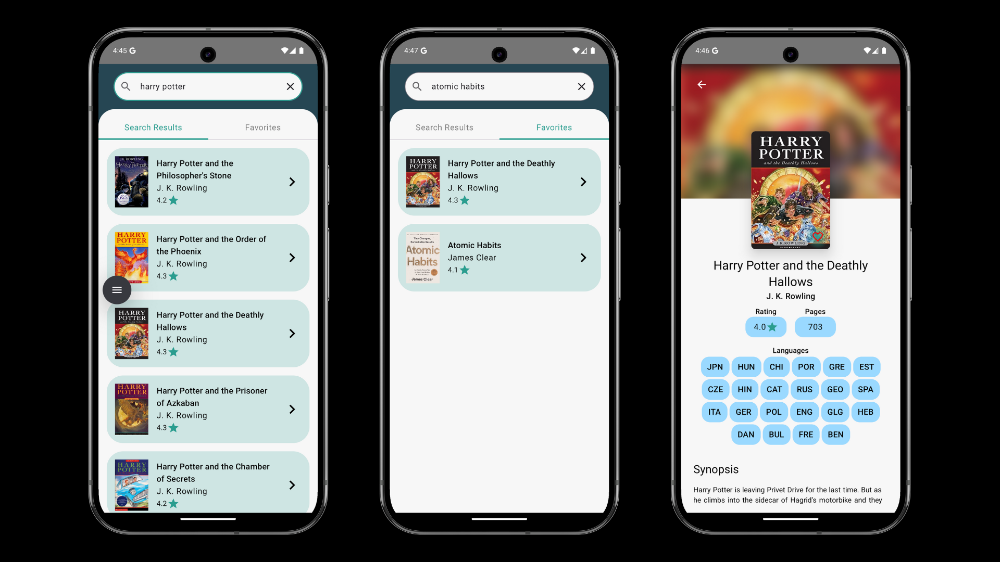

# Bookpedia - Compose Kotlin Multiplatform

This is a Kotlin Multiplatform project targeting Android, iOS, Desktop.

  

## Tech Stack

- Kotlin
- Coroutines
- Kotlinx Serialization
- Ktor
- Compose Multiplatform
- Koin
- SQLDelight
- Coil

This project is based on this [crash course](https://youtu.be/WT9-4DXUqsM?si=VnqIZPfdfU4ZPjt1) by [Philipp Lackner](https://github.com/philipplackner).
